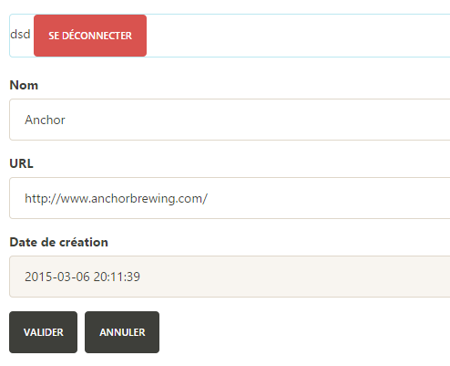
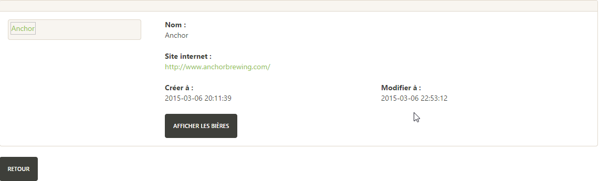
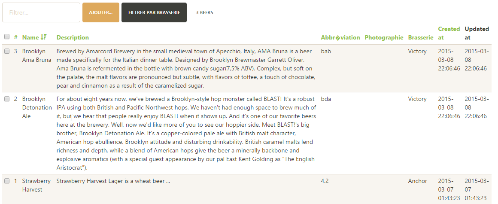

#My-open-beer-angular
Ce projet a été réalisé par :
*Alexis Lagoutte (Pseudonyme GitHub : Senekfirst)
*Paul Lemesnager (Pseudonyme GitHub : PaulLmsg)

#Le travail
Tout d'abord, ayant eu de nombreux problèmes avec GitHub (Paul Lemesnager) les commits ont tous été effectués par Alexis, je lui passais mon travail par clé pour qu'il puisse mettre à jour le projet.
L'application my-open-beer-angular permet la consultation en ligne de plusieurs brasseries ainsi que les bières qu'elles proposent qui sont récupérées depuis une API REST en ligne. 
Lorque l'utilisateur est connecté il peut également ajouter des brasseries ou des bières. 
	
Nous allons maintenant détailler d'un point de vue technique puis fonctionnel les fonctionnalités implémentées dans l'application.

##La structure :
L'application respecte le modèle MVC, les traitements sont séparés de la vue. Chaque fonctionnalité implémentée l'est par un contrôleur javascript qui contient toutes les fonctions nécessaires. On a donc, par exemple, un contrôleur pour l'affichage d'une bière, beerShowController (de même pour une brasserie), et le formulaire, et donc la vue, qui correspond, beerShowForm. On retrouvera la même chose pour la modification et l'ajout de bière et de brasserie ainsi que pour la configuration et la sauvegarde
		
##L'architecture
###Les contrôleurs
####beerAddController et brewerieAddController
> Ces contrôleurs concerne l'ajout de bière et de brasserie dans la base :
- [x] ils récupèrent les données concernant les bières et les brasseries
- [x] ils déterminent le formulaire qui doit être afficher (beer ou breweryForm)
- [x] il redirige l'utilisateur selon l'action qu'il fait (ajout, annulation,...)
- [x] il insère la bière ou la brasserie dans la base en vérifiant si elle existe déjà et permet la sauvegarde si la bière ou la brasserie n'existe pas.
				
####beerShowController et brewerieShowController :
> Ces contrôleurs concernent l'affichage de bière et de brasserie :
- [x] ils vérifient si une bière ou une brasserie est active, sélectionnée
- [x] ils déterminent le formulaire qui doit être affiché (beer ou brewerieShowForm)
- [x] ils affichent dans le formulaire correspondant aux données de la bière ou de la brasserie active
				
####beerUpdateController et brewerieUpdateController :
> Ces contrôleurs concernent la modification de bière et de brasserie dans la base :
- [x] ils vérifient si une bière ou une brasserie est active (sélectionnée)
- [x] ils déterminent le formulaire qui doit être affiché (beer ou breweryShowForm)
- [x] ils modifient la bière ou la brasserie sélectionnée avec les informations remplies dans le formulaire et sauvegardent l'opération
				
####beerController et brewerieController :
> Ces contrôleurs concernent la liste de bières et de brasseries :
- [x] ils récupèrent les données concernant les bières et les brasseries
- [x] ils regroupent toutes les fonctions pour le listage des bières ou des brasseries :
- [x] suppression d'une ou plusieurs bières ou brasseries
- [x] le tri par brasserie dans la liste des bières
- [x] la redirection vers les formulaires de modification et d'affichage en détail
- [x] le compte des bières ou brasseries sélectionnées
- [x] l'affichage de message d'erreurs, de confirmations, ...
- [x] le raffraichissement de la liste
- [x] la selection de toutes les données 
- [x] le filtre par nom
- [x] une fonction permettant de cacher ou d'afficher les données supprimées 
		
####configController :
> Ce contrôleur concerne la page de configuration de l'application
- [x] il détermine le formulaire qui doit être affiché (config)
- [x] copie la configuration située dans la factory
- [x] permet la modification de ces paramètres
		
####saveController :
> Ce contrôleur concerne la sauvegarde des opérations effectuées
			
####securityController : 
> Ce contrôleur concerne la connexion à l'application :
- [x] il récupère les champs et vérifie si ils sont correctent
- [x] il permet la deconnexion 
- [x] il affiche les messages lors de la connexion et de la deconnexion
				
####mainController :
> Ce contrôleur regroupe quelques fonctions concernant les opérations
					
###Les vues :	
Les vues sont les formulaires et les pages que l'on affiche dans l'application.
		
- [x] beerForm et brewerieForm :
			Ce sont les formulaires utilisés pour l'ajout d'une bière ou d'une brasserie, on y retrouve les champs obligatoires pour l'ajout d'une données et la date de création entrée par l'horloge
				
		
- [x] beerShowForm et brewerieShowForm :
			Ce sont les formulaires utilisés pour la modification et l'affichage en détail d'une bière ou d'une brasserie, on y retrouve tous les champs de ces données :
				
				
- [x] main (beers et breweries) :
			Ce sont les formulaires utilisés pour lister les données, on y retrouve des boutons pour afficher en détail, modifier la donnée sélectionnée, le filtre... . Pour celui des bières il y a aussi un tableau qui s'affiche lorsque l'on souhaite afficher par brasseries :
				
				
- [x] main :
			C'est le formulaire de la page d'accueil avec les boutons pour accéder aux listes, aux ajouts des données, aux opérations en attente et à la configuration : 
				
		
- [x] configuration :
			C'est le formulaire de la page de configuration, y est affichée la configuration actuelle et les boutons permettant le retour et celui de la sauvegarde en cas de modification
				
				
- [x] saveMain :
			C'est le formulaire qui affiche les opérations en attentes et des données la concernant qui peuvent être filtrées. On peut confirmer ou supprimer l'opération avec les boutons correspondant :
				
				
###Les services :	
Les services regroupent les fonctions que l'on utilise dans les contrôleurs.
- [x] rest est le service pour l'accès aux données il contient les fonctions pour supprimer, récuperer et ajouter des données (ici des bières et des brasseries)
- [x] save est le service regroupant les fonctions utilisées pour les opérations c'est à dire l'ajout et l'execution d'une ou plusieurs opérations.
		
##Les fonctionnalités	
Voici toutes les fonctionnalités implémentées par nous (les fonctionnalités initiales n'importent pas) dans notre application :
- [x]  l'affichage de la liste des bières
- [x]  l'affichage de la liste des bières par brasserie
- [x]  l'affichage de la liste des bières d'une brasserie depuis un bouton sur la page de cette brasserie (ne fonctionne qu'en partie, nous données arrivent mais la liste des bières est vide..)
- [x]  l'ajout d'une bière (il devrait fonctionner, nécessite de charger les brasseries avant)
- [x]  la modification d'une bière
- [x]  la suppression d'une bière
- [x]  l'affichage d'une bière (avec son nom de brasserie)
- [x]  la possibilité de visiter une brasserie directement depuis une bière (le bouton)
- [x]  la connexion (simulée, pas de base pour se connecter chez l'un de nous)
- [x]  le verrouillage de certains boutons en cas de non-connexion (ils sont cachés)
- [x]  la déconnexion 

##Les erreurs
Alors nous ne les listerons pas, mais des erreurs ponctuelles ont ponctué notre développement, 
plantant jusqu'à Apache, et ce sans raison visible; nous en avons corrigé un nombre elevé mais il devrait en rester..
		
	